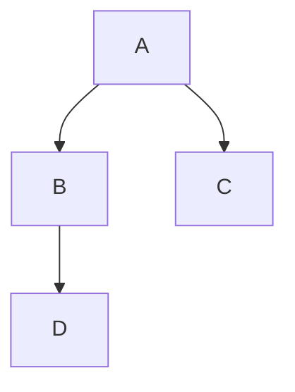

# Markdown 语法入门

正文：这是正文方式  
换行空两格

```java
public void text1(){
    System.out.println("hello, world!");
    this.add();
}
//这是一块代码
```

正文中的代码(行内代码)：`public void text1(){System.out.println("你好！！！")}`

有序列表

1. yi
2. er
3. 一级标题
   1. 二级标题
      1. 三级标题

无序列表

- 你美好
- 窝气
- 一级标题
  - 二级标题
    - 三级标题

加粗**这是加粗**  
倾斜*这是倾斜*
_倾斜_
~~删除线~~


[回到顶部](#目录)

> 引用
>
> > 二级引用
> >
> > > 三级引用

利用符号（|）（-）（:）
| 班级 | 姓名 | 学号 |
| ---- | :----: | :----: |
| 一班 | 张三 | 01 |
| 二班 | 李四 | 02 |

:blush:

:black_circle:

:recycle:
$$
x^2+y^2=z^2
$$



